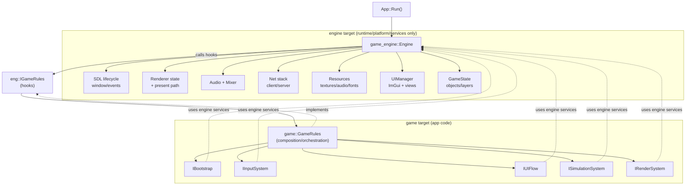
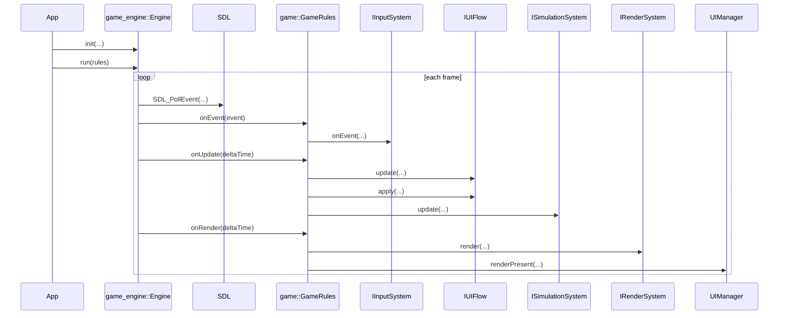

# 2D Game Engine

2D SDL3-based game project split into an `engine` static library and a `game` app.
It is meant to be used alongside `Tiled` to create levels and `Asperite` to create textures.

## Repo Layout

```text
engine/
  include/engine/
    engine.h
    igame_rules.h
    ui_manager.h
    net/
  src/
game/
  include/game/
    app.h
    default_systems.h
    game_rules.h
    interfaces/
      i_bootstrap.h
      i_input_system.h
      i_ui_flow.h
      i_simulation_system.h
      i_render_system.h
    ui_controller.h
    level_manifest.h
  src/
    main.cpp
    app.cpp
    game_rules.cpp
    default_bootstrap.cpp
    default_input_system.cpp
    default_ui_flow.cpp
    default_simulation_system.cpp
    default_render_system.cpp
    ui_controller.cpp
    level_manifest.cpp
```

## Game Extension Model

`engine::Engine` is runtime/services-only (SDL lifecycle, networking, audio plumbing, resource accessors).

Game behavior is provided by required game interfaces implemented in `game/`:

- `IBootstrap` - load assets and build initial world
- `IInputSystem` - map SDL events to game input/snapshots
- `IUIFlow` - update/apply UI actions
- `ISimulationSystem` - gameplay update/collision/state
- `IRenderSystem` - world render decisions

`GameRules` composes these systems and drives them through `eng::IGameRules` hooks.

To create a new game on this engine, provide new implementations for those 5 interfaces and wire them in `game/src/game_rules.cpp`.

## Architecture Diagram

### 1) Static architecture (who owns what)

```text
                                 +----------------------+
                                 |     game target      |
                                 |      (app code)      |
                                 +----------+-----------+
                                            |
                                            | links
                                            v
+-----------------------------------------------------------------------------------+
|                                   engine target                                    |
|                        (runtime/platform/services only)                            |
|                                                                                   |
|  +------------------+   +----------------+   +----------------+   +------------+ |
|  | SDL lifecycle    |   | Renderer state |   | Audio + Mixer  |   | Net stack  | |
|  | window/events    |   | + present path |   | + track helpers|   | client/server|
|  +------------------+   +----------------+   +----------------+   +------------+ |
|                                                                                   |
|  +------------------+   +----------------+   +----------------+                   |
|  | Resources        |   | UIManager      |   | GameState      |                   |
|  | textures/audio   |   | ImGui + views  |   | objects/layers |                   |
|  +------------------+   +----------------+   +----------------+                   |
+-----------------------------------------------------------------------------------+
                                            ^
                                            |
                                            | calls hooks on
                                            |
                              +-------------+------------------+
                              |        eng::IGameRules         |
                              +-------------+------------------+
                                            ^
                                            |
                        +-------------------+-------------------+
                        |           game::GameRules             |
                        |        (composition/orchestration)    |
                        +----+-----------+-----------+----------+
                             |           |           |
                             v           v           v
                +----------------+ +----------------+ +---------------------+
                | IBootstrap     | | IInputSystem   | | IUIFlow             |
                +----------------+ +----------------+ +---------------------+
                             \           |           /
                              \          |          /
                               v         v         v
                        +----------------+ +----------------+
                        | ISimulation    | | IRenderSystem  |
                        +----------------+ +----------------+
```

Mermaid version:



### 2) Runtime frame flow (who runs each frame)

```text
App::Run()
  -> Engine::init(...)
  -> Engine::run(rules)

Engine::run loop:
  1) SDL_PollEvent(...)
        -> ImGui_ImplSDL3_ProcessEvent(...)
        -> rules.onEvent(...)
             -> IInputSystem::onEvent(...)

  2) rules.onUpdate(deltaTime)
        -> IUIFlow::update(...)
        -> IUIFlow::apply(...)
        -> ISimulationSystem::update(...)

  3) rules.onRender(deltaTime)
        -> IRenderSystem::render(...)
        -> UIManager::renderPresent(...)
```

Mermaid version:



## How To Start A New Game With This Engine

### Step-by-step

1. Create game systems that implement the required interfaces:
   - `IBootstrap`
   - `IInputSystem`
   - `IUIFlow`
   - `ISimulationSystem`
   - `IRenderSystem`

2. Keep your game-specific code in `game/`:
   - world creation/spawning in your bootstrap
   - controls and input mapping in input system
   - menu/view transitions in UI flow
   - combat/physics/rules in simulation
   - sprite/tile/world rendering decisions in render system

3. Wire your implementations into `GameRules` (constructor injection):

```cpp
// Example usage pattern
game::GameRules rules(
  font,
  std::make_unique<MyBootstrap>(),
  std::make_unique<MyInputSystem>(),
  std::make_unique<MyUIFlow>(),
  std::make_unique<MySimulationSystem>(),
  std::make_unique<MyRenderSystem>());
```
   - example: DefaultSimulationSystem is an implementation of ISimulationSystem. The impl gets used in GameRules::onUpdate ( via `simulationSystem_->update(...)` ) which is a hook into the game engine flow.

4. Run with the existing app shell:
   - `App::Run()` creates `Engine`
   - pass your `GameRules` instance to `engine.run(rules)`

5. Build and test:
   - `cmake --preset default`
   - `cmake --build build --target game -j2`

### Minimal implementation order

1. `IBootstrap` first (loads resources + builds initial world)
2. `IRenderSystem` second (draw the world)
3. `IInputSystem` third (basic movement/actions)
4. `ISimulationSystem` fourth (state updates/collision)
5. `IUIFlow` last (menus, pause, scene overlays)

This order gets a runnable prototype quickly, then layers behavior cleanly.

## Build

Configure:

```bash
cmake --preset default
```

Build engine + game app:

```bash
cmake --build build --target game -j2
```

Run from build output:

```bash
./build/JeetersCastle.app/Contents/MacOS/JeetersCastle
```

## macOS App Bundle Packaging

This project includes a dedicated bundle target that creates a standalone `.app` with:

- executable in `Contents/MacOS`
- game assets in `Contents/Resources/data`
- runtime dylibs in `Contents/Frameworks` with fixed install names

Build the bundle:

```bash
cmake --preset default
cmake --build build --target game -j2
cmake --build build --target bundle_game
```

Or use the repo helper script:

```bash
./scripts/build_bundle.sh
```

Notes:

- `game` builds the actual `JeetersCastle.app` executable target.
- `bundle_game` runs the extra macOS bundle fixup step so the app is easier to move to another Mac.
- `./scripts/build_bundle.sh` runs configure, builds `game`, runs `bundle_game`, and prints link/minimum-OS verification output.

Bundle output:

```text
build/JeetersCastle.app
```

### Bundle Layout and File Roles

```text
build/JeetersCastle.app/
  Contents/
    Info.plist
    MacOS/
      JeetersCastle
    Resources/
      data/
        maps/
        players/
        enemies/
        audio/
        cutscenes/
        tiles/
        ...
    Frameworks/
      libSDL3.0.dylib
      libSDL3_image.0.dylib
      libSDL3_mixer.0.dylib
      libSDL3_ttf.0.dylib
      libglm.dylib
      libfreetype.6.dylib
      libpng16.16.dylib
      ...
```

- `Contents/Info.plist`
  - macOS bundle metadata (name, identifier, version).
  - Generated from `cmake/MacBundle.plist.in`.
- `Contents/MacOS/JeetersCastle`
  - Main executable built from this repo.
- `Contents/Resources/data`
  - Full copy of the repo `data/` folder.
  - All runtime asset paths in code (`data/...`) resolve here.
- `Contents/Frameworks`
  - Dynamic libraries copied during bundle fixup.
  - Install names rewritten to `@executable_path/../Frameworks/...`.

### Runtime Path Behavior

At startup, `App::Run()` detects if it is running from `.app/Contents/MacOS` and changes current working directory to `.app/Contents/Resources`.
This keeps existing relative asset paths (for example `data/cutscenes/fonts/...`) working without changing all loaders.

### Verify the Bundle

Check bundle exists:

```bash
test -d build/JeetersCastle.app && echo OK
```

Check a packaged asset:

```bash
test -f build/JeetersCastle.app/Contents/Resources/data/maps/level_1/level_1.tmx && echo OK
```

Inspect dylib linkage:

```bash
otool -L build/JeetersCastle.app/Contents/MacOS/JeetersCastle
```

You should see SDL and related libs resolved from:

```text
@executable_path/../Frameworks/
```

Launch bundle:

```bash
open "build/JeetersCastle.app"
```

## Packaging Implementation Files

- `CMakeLists.txt`
  - macOS bundle properties
  - resource copy step
  - `bundle_game` target
- `cmake/MacBundle.plist.in`
  - Info.plist template
- `cmake/FixupBundle.cmake.in`
  - `fixup_bundle(...)` script used by `bundle_game`
- `game/src/app.cpp`
  - runtime cwd switch to `Contents/Resources` when launched from bundle
